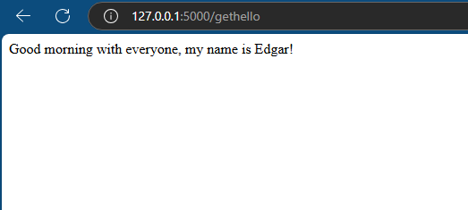

# Flask Microservice Example

This is a simple Flask application that exposes a REST API endpoint.

## Description

This project is a simple Flask microservice that provides a REST API with a single endpoint, `/gethello`. The endpoint returns a greeting message. The application demonstrates the use of Flask to create a basic web service.

## Features

- Flask application.
- RESTful API with one endpoint: `/gethello`.
- Returns a greeting message: "Good morning with everyone, my name is Edgar".

## Prerequisites

To run this application locally, you will need the following:

- Python 3.8 or higher
- pip (Python package installer)
- IDE or text editor like Visual Studio Code, PyCharm, or Sublime Text (optional but recommended)

## Installation

### Clone the repository

```bash
git clone [https://github.com/epgarzonr10/FlaskServicePython.git]
cd FlaskServicePython
```
### Install dependencies
```
pip install -r requirements.txt
```
## Run the Application
```
python Hello.py
```
## Results
<p align="center">
  
</p>

> [!IMPORTANT]
> When accessing the Flask application, make sure to include the `/gethello` route in the URL to get the server's response. 
> Also, verify that you are using the correct route and port provided by your IDE when running the server. 
> For example, if your IDE indicates the server is running on `http://localhost:5000`, the full URL to access the route would be:
> 
> ```
> http://localhost:5000/gethello
> ```
> 
> Ensure that the port matches the one being used by your development environment.

